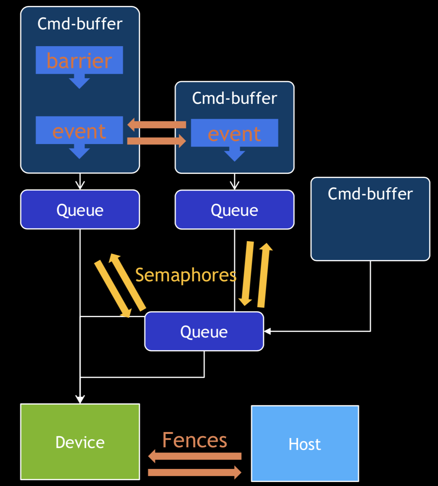
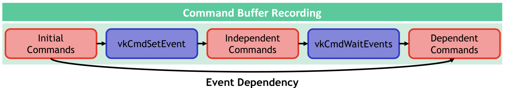
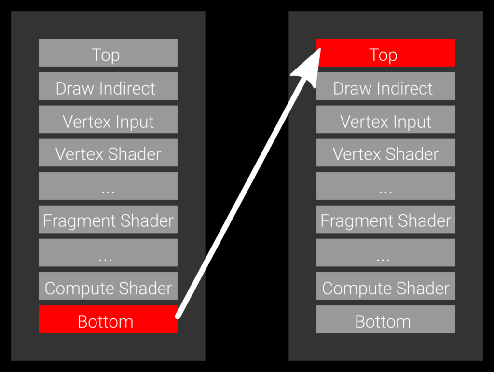
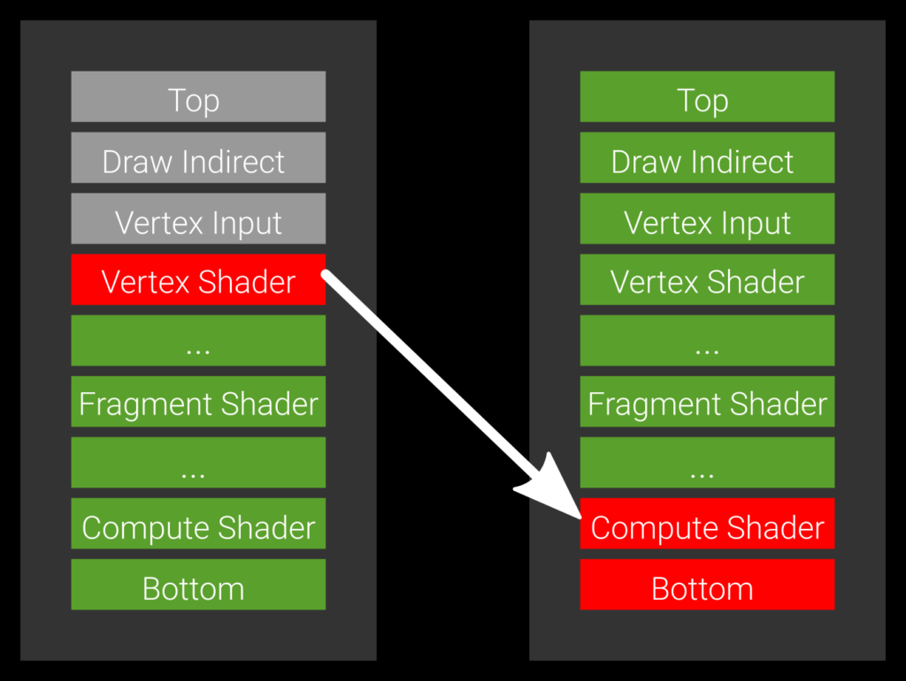

# 同步

## 资料

1. https://github.com/KhronosGroup/Vulkan-Guide/blob/master/chapters/synchronization.md
2. [Synchronization Examples](https://github.com/KhronosGroup/Vulkan-Docs/wiki/Synchronization-Examples)
   1. Khronos官方提供的同步相关的example
3. [Frames in Flight](https://vulkan-tutorial.com/Drawing_a_triangle/Drawing/Rendering_and_presentation)
   1. 介绍了多帧并发处理中，如何使用Semaphore和Fence进行同步
   2. 具体代码：https://github.com/Overv/VulkanTutorial/blob/master/code/15_hello_triangle.cpp
4. [Yet another blog explaining Vulkan synchronization](http://themaister.net/blog/2019/08/14/yet-another-blog-explaining-vulkan-synchronization/)

## 同步

1. Fence
2. Semaphore
3. Event
4. Pipeline Barrier
5. Subpass Dependency
6. WaitIdle




## Fence

### 用途

1. 用于CPU和GPU之间的同步
2. 主要用在通知CPU，command buffer执行完毕

### API

#### 创建Fence

**注意**：fence的flags如果不指定，创建的fence是**没有信号状态**。如果设置为`VK_FENCE_CREATE_SIGNALED_BIT`，则创建的fence是**有信号状态**。

```cpp
VkResult vkCreateFence(
    VkDevice                                    device,
    const VkFenceCreateInfo*                    pCreateInfo,
    const VkAllocationCallbacks*                pAllocator,
    VkFence*                                    pFence);

typedef struct VkFenceCreateInfo {
    VkStructureType       sType;
    const void*           pNext;
    VkFenceCreateFlags    flags;
} VkFenceCreateInfo;

typedef enum VkFenceCreateFlagBits {
    VK_FENCE_CREATE_SIGNALED_BIT = 0x00000001,
    VK_FENCE_CREATE_FLAG_BITS_MAX_ENUM = 0x7FFFFFFF
} VkFenceCreateFlagBits;
```

#### 销毁Fence

```cpp
void vkDestroyFence(
    VkDevice                                    device,
    VkFence                                     fence,
    const VkAllocationCallbacks*                pAllocator);
```

#### 重置Fence为无信号状态

```cpp
VkResult vkResetFences(
    VkDevice                                    device,
    uint32_t                                    fenceCount,
    const VkFence*                              pFences);
```

#### 获取Fence状态

成功时，

1. 返回VK_SUCCESS，表示fence是有信号状态
2. 返回VK_NOT_READY，表示fence是无信号状态

```cpp
VkResult vkGetFenceStatus(
    VkDevice                                    device,
    VkFence                                     fence);
```

#### 等待Fence变为有信号状态

1. 阻塞操作
2. waitAll为TRUE时，所有fence都变为有信号状态，才返回。如果为FALSE，有1个fence变为有信号状态就返回。
3. timeout为0时，不等待直接返回，返回当前的状态。如果返回VK_TIMEOUT，表示当前的条件还不满足。
4. 如果timeout到了，条件还不满足，返回VK_TIMEOUT。如果条件满足，返回VK_SUCCESS。

```cpp
VkResult vkWaitForFences(
    VkDevice                                    device,
    uint32_t                                    fenceCount,
    const VkFence*                              pFences,
    VkBool32                                    waitAll,
    uint64_t                                    timeout);
```


## Semaphore

### 用途

1. 用于GPU和GPU之间的同步
2. 用于同一个queue内部或者不同queue之间

### API

创建Semaphore

销毁Semaphore

```cpp
VKAPI_ATTR VkResult VKAPI_CALL vkCreateSemaphore(
    VkDevice                                    device,
    const VkSemaphoreCreateInfo*                pCreateInfo,
    const VkAllocationCallbacks*                pAllocator,
    VkSemaphore*                                pSemaphore);

VKAPI_ATTR void VKAPI_CALL vkDestroySemaphore(
    VkDevice                                    device,
    VkSemaphore                                 semaphore,
    const VkAllocationCallbacks*                pAllocator);
```


## Event

### 用途

1. 细粒度的同步原语
2. 同一个queue中的command之间同步
3. CPU和GPU之间同步，用于CPU和queue之间




## Pipeline Stage

## Access Type

## Pipeline Barrier

### 用途

1. 同一个queue中的command之间同步
2. 同一个subpass中的command之间同步


参考：https://gpuopen.com/vulkan-barriers-explained/

**Example 1: a slow barrier, specifying the bottom of the pipe as the source stage and the top of pipe as the target stage.**




**Example 2: the optimal barrier which allows all green pipeline stages to execute.**




## Render Pass


## 多帧并发处理

下面的例子，同时并发**2帧**。

**为什么需要同步？**

1. 命令是按照顺序执行，但是命令返回时，**该命令不一定执行完**
2. 下一条命令开始时，需要等待上一条命令执行完


每一帧都有自己独立的Semaphore和Fence，其中：

1. `Semaphore`用于**GPU和GPU间同步**，主要用于Queue中命令之间同步
2. `Fence`用于**CPU和GPU间同步**，主要用于通知CPU，submit的command buffer已经执行完毕
3. `imageAvailableSemaphores`：``vkAcquireNextImageKHR获取到image之后，该信号量为**有信号**状态，`vkQueueSubmit`等待该信号量
4. `renderFinishedSemaphores`：`vkQueueSubmit`**对应的command buffer执行完**之后，该信号量为**有信号**状态，`vkQueuePresentKHR`等待该信号量
5. `inFlightFences`：`vkQueueSubmit`中**所有的command buffer都执行完**之后，该fence为有信号状态，用于CPU侧和GPU侧同步
6. `imagesInFlight`

```c++
const int MAX_FRAMES_IN_FLIGHT = 2;

std::vector<VkSemaphore> imageAvailableSemaphores;
std::vector<VkSemaphore> renderFinishedSemaphores;
std::vector<VkFence> inFlightFences;
std::vector<VkFence> imagesInFlight;
size_t currentFrame = 0;

void createSyncObjects() {
    imageAvailableSemaphores.resize(MAX_FRAMES_IN_FLIGHT);
    renderFinishedSemaphores.resize(MAX_FRAMES_IN_FLIGHT);
    inFlightFences.resize(MAX_FRAMES_IN_FLIGHT);
    imagesInFlight.resize(swapChainImages.size(), VK_NULL_HANDLE);

    VkSemaphoreCreateInfo semaphoreInfo = {};
    semaphoreInfo.sType = VK_STRUCTURE_TYPE_SEMAPHORE_CREATE_INFO;

    VkFenceCreateInfo fenceInfo = {};
    fenceInfo.sType = VK_STRUCTURE_TYPE_FENCE_CREATE_INFO;
    fenceInfo.flags = VK_FENCE_CREATE_SIGNALED_BIT;

    for (size_t i = 0; i < MAX_FRAMES_IN_FLIGHT; i++) {
        if (vkCreateSemaphore(device, &semaphoreInfo, nullptr, &imageAvailableSemaphores[i]) != VK_SUCCESS ||
            vkCreateSemaphore(device, &semaphoreInfo, nullptr, &renderFinishedSemaphores[i]) != VK_SUCCESS ||
            vkCreateFence(device, &fenceInfo, nullptr, &inFlightFences[i]) != VK_SUCCESS) {
            throw std::runtime_error("failed to create synchronization objects for a frame!");
        }
    }
}
```


```cpp
void drawFrame() {
    vkWaitForFences(device, 1, &inFlightFences[currentFrame], VK_TRUE, UINT64_MAX);

    uint32_t imageIndex;
    vkAcquireNextImageKHR(device, swapChain, UINT64_MAX, imageAvailableSemaphores[currentFrame], VK_NULL_HANDLE, &imageIndex);

    if (imagesInFlight[imageIndex] != VK_NULL_HANDLE) {
        vkWaitForFences(device, 1, &imagesInFlight[imageIndex], VK_TRUE, UINT64_MAX);
    }
    imagesInFlight[imageIndex] = inFlightFences[currentFrame];

    VkSubmitInfo submitInfo = {};
    submitInfo.sType = VK_STRUCTURE_TYPE_SUBMIT_INFO;

    VkSemaphore waitSemaphores[] = {imageAvailableSemaphores[currentFrame]};
    VkPipelineStageFlags waitStages[] = {VK_PIPELINE_STAGE_COLOR_ATTACHMENT_OUTPUT_BIT};
    submitInfo.waitSemaphoreCount = 1;
    submitInfo.pWaitSemaphores = waitSemaphores;
    submitInfo.pWaitDstStageMask = waitStages;

    submitInfo.commandBufferCount = 1;
    submitInfo.pCommandBuffers = &commandBuffers[imageIndex];

    VkSemaphore signalSemaphores[] = {renderFinishedSemaphores[currentFrame]};
    submitInfo.signalSemaphoreCount = 1;
    submitInfo.pSignalSemaphores = signalSemaphores;

    vkResetFences(device, 1, &inFlightFences[currentFrame]);

    if (vkQueueSubmit(graphicsQueue, 1, &submitInfo, inFlightFences[currentFrame]) != VK_SUCCESS) {
        throw std::runtime_error("failed to submit draw command buffer!");
    }

    VkPresentInfoKHR presentInfo = {};
    presentInfo.sType = VK_STRUCTURE_TYPE_PRESENT_INFO_KHR;

    presentInfo.waitSemaphoreCount = 1;
    presentInfo.pWaitSemaphores = signalSemaphores;

    VkSwapchainKHR swapChains[] = {swapChain};
    presentInfo.swapchainCount = 1;
    presentInfo.pSwapchains = swapChains;

    presentInfo.pImageIndices = &imageIndex;

    vkQueuePresentKHR(presentQueue, &presentInfo);

    currentFrame = (currentFrame + 1) % MAX_FRAMES_IN_FLIGHT;
}
```

## Wait Idle

vkQueueWaitIdle：等待queue所有操作完成

vkDeviceWaitIdle：等待device上所有的queue的所有操作完成

